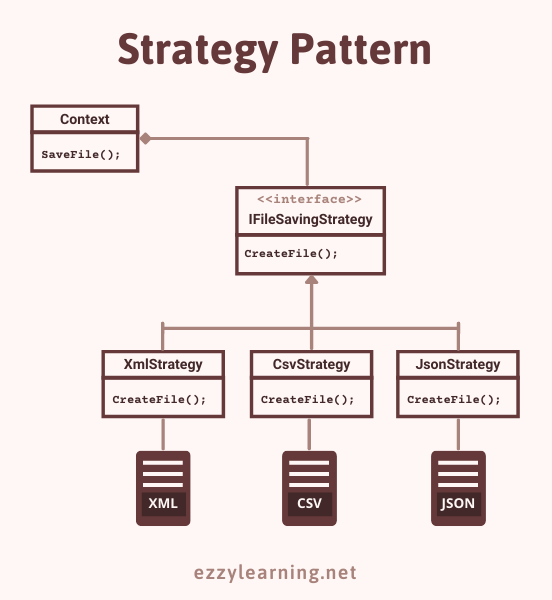
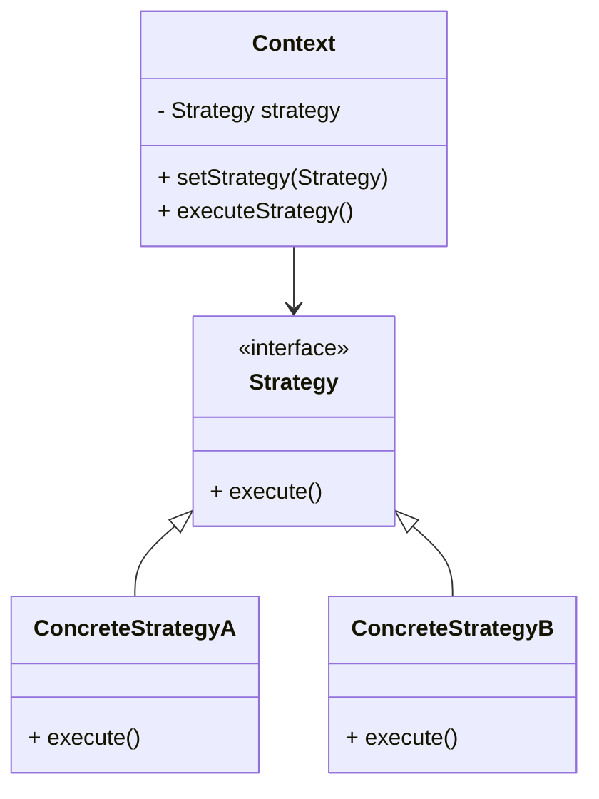

# 🧠 Padrão de Projeto Strategy (Resumo para Iniciantes)


O **Strategy** é um **padrão de projeto comportamental** que ajuda a trocar a forma como um algoritmo funciona **sem mudar o código principal** da aplicação.
Em vez de colocar várias condições (`if`, `switch`) para escolher como algo vai ser feito, o Strategy **separa cada comportamento em uma classe própria** e permite trocar esses comportamentos de forma flexível.
<p align="center">
  
</p>

___
### 📌 Problema

Imagine que você tenha um sistema de **pagamentos** que aceita **Cartão de Crédito**, **Boleto** e **Pix**.
Se você colocar toda a lógica dentro de uma única classe usando vários `ifs`, o código vai:

- Ficar **difícil de manter**
- Ser **complicado de entender** 
- Ficar **grande e confuso** 
- Quebrar facilmente quando mudar algo
___

### 💡 Solução com Strategy

O **Strategy** sugere:

1. Criar uma **interface** com o método comum (ex: `pagar()`).
2. Criar **classes separadas** para cada forma de executar esse método (ex: `PagamentoCartao`, `PagamentoPix`, `PagamentoBoleto`). 
3. Ter uma classe **Contexto** que **recebe** uma dessas estratégias e **executa** sem saber qual foi escolhida.

Dessa forma:

- Você pode **adicionar novos comportamentos** sem alterar o código existente. 
- O código fica **organizado e fácil de entender**. 
- Segue o **Princípio Aberto/Fechado** (_Open/Closed Principle_).

___
### 🔍 Analogia do Mundo Real

Pense que você quer ir ao **aeroporto**.
Você pode ir de:

- 🚗 Táxi 
- 🚲 Bicicleta 
- 🚌 Ônibus

Essas são **estratégias diferentes** para o mesmo objetivo: **chegar ao aeroporto**.
Você escolhe qual usar conforme o momento, mas o **destino é o mesmo**.

___
### 📂 Estrutura Básica

<p align="center">
  
</p>


___
### ✅ Vantagens

- Troca de comportamento **em tempo de execução**. 
- **Menos ifs e switch** no código. 
- Mais **organização e manutenção fácil**. 
- Pode **adicionar novos comportamentos** sem quebrar os existentes.
___
### ⚠️ Desvantagens

- Mais classes e arquivos para gerenciar. 
- Pode ser exagero se só existir **1 ou 2 comportamentos fixos**.
___
### 📌 Exemplo Simples (Java)

```java
interface PaymentStrategy {
    void pay(double amount);
}

class PixPayment implements PaymentStrategy {
    public void pay(double amount) {
        System.out.println("Pagando R$" + amount + " via Pix");
    }
}

class CreditCardPayment implements PaymentStrategy {
    public void pay(double amount) {
        System.out.println("Pagando R$" + amount + " via Cartão de Crédito");
    }
}

class PaymentProcessor {
    private PaymentStrategy strategy;

    public void setStrategy(PaymentStrategy strategy) {
        this.strategy = strategy;
    }

    public void process(double amount) {
        strategy.pay(amount);
    }
}

public class Main {
    public static void main(String[] args) {
        PaymentProcessor processor = new PaymentProcessor();

        processor.setStrategy(new PixPayment());
        processor.process(100.0);

        processor.setStrategy(new CreditCardPayment());
        processor.process(250.0);
    }
}
```
<p align="center">  </p>

___
### 📖 Quando Usar

- Quando você tem **várias formas diferentes** de executar a mesma tarefa. 
- Quando quer **remover ifs e switch** que escolhem o algoritmo. 
- Quando quer que seu código seja **flexível** e fácil de expandir.

___
### 🏆 Desafio

Se quiser praticar o **Strategy**, confira o código do desafio no package:

➡️ [`com.github.rickmvi.strategy.challenge`](https://github.com/SEU_USUARIO/SEU_REPO/tree/main/src/main/java/com/github/rickmvi/strategy/challenge)
